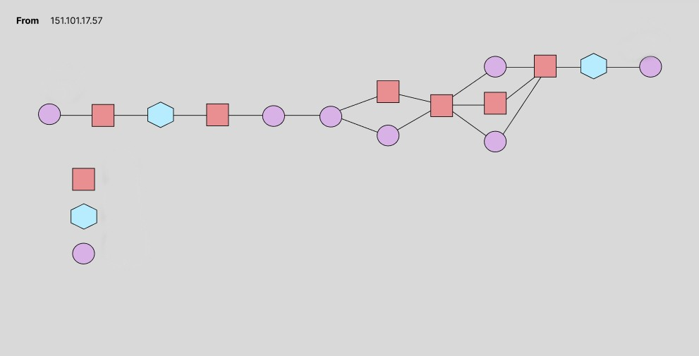
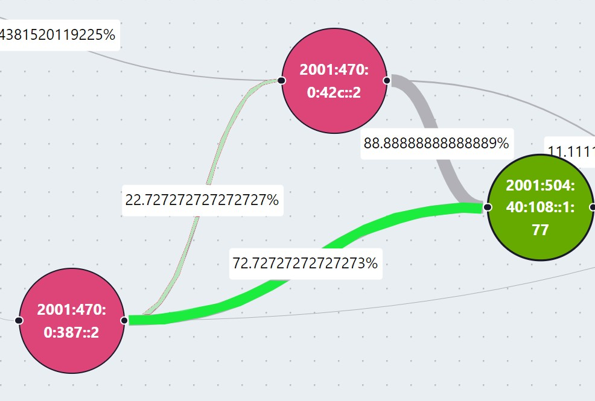

# PATHly Visualizer

A project done in collaboration with [Fastly](https://www.fastly.com/) and [WPI](https://www.wpi.edu/)

The project can be found and utilized [here](http://34.23.240.59/)

### `File Structure`
This section will show off the general file structure system, a more in depth file structure for the frontend is found in the frontend [folder](./frontend)
```javascript
. //Root Folder
├── .github // GitHub Action Tests
├── frontend // Frontend code of PATHly (reminder that a detailed file structure of frontend is in frontend folder)
└── src // Backend code of PATHly
    ├── asn // IP to ASN mapping
    ├── config // Server configuration (uses .env file if exists)
    ├── probe // Probe collection, mapping, and storage
    ├── rest_api // REST API configuration
    ├── ripe_atlas
    ├── service // Service model, initiates all services on backend (i.e. traceroute, ip to asn, etc.)
    ├── traceroute // Traceroute processing and storage
    └── server.go // Base server, initializes all services and API routes
```

### `Installing Backend Dependencies`
The backend requires several different external packages to run. Installing them requires the following steps:
1. Verify the Go programming language is installed on your machine. If not, follow the quick instructions to get it installed [here](https://go.dev/doc/install)
2. Once Go is installed, verify the GOPATH .env variable is set up correctly by using following command in the terminal: 
```javascript
go version
```
3. Once working, CD into the ./src folder and run the following command in the terminal to install all dependencies:
```javascript
go get .
```

### `Running the Server Locally`
If all dependencies are installed locally, running the server should only require the following steps:
1. CD into the ./src folder and run the following command in the terminal:
```javascript
go run server.go
```
2. If prompted, allow access from Firewall (we promise this application isn't a virus)

### `Running the Application Locally`
The application should be relatively simple to run locally. There are detailed steps in the frontend [folder](./frontend/) on how to start the frontend locally. Minor modifications may need to be made to the Fetch URLs in the frontend code. When hosting locally, all REST API URLs must follow this format:
```javascript
"http://localhost:8080/..."
```

### `Future Work`
The following section will describe future work that can be done for both the frontend and backend of PATHly.
1. Full implementation of missing routes specified in [documentation](https://github.com/jmeggitt/fastly_anycast_experiments/blob/api_design/REST_API.md#measurement-tracking). Currently, the work is mostly complete for the “Get Probes” API route. However, it was not fully working by the time we needed to complete active development. This API route would work by checking when a user selects a destination IP address on the front-end, and send a request with the destination address as the body to get all probes linked with it. These probes would then be used to populate a selection menu, rather than having the user input a probe manually. This would eliminate user input error, as any probe that a user could choose should both exist, and be connected to the destination address. The “Get Destinations” API route would also be an important addition. Currently, users are able to start new RIPE Atlas measurement tracking from the front-end, but are unable to visually represent these measurements. If the “Get Destinations” API were implemented, the front-end would create a GET request to fetch the array of all possible current destinations every time PATHly’s home page is opened. These destinations would then populate the destination selection menu.
2. Further methods of testing are needed. Firstly, more CI (Continuous Integration) using GitHub [Actions](https://github.com/jmeggitt/fastly_anycast_experiments/actions). The tests we have are necessary and important for ensuring that newly pushed code does not break any functionality we currently have. However, more tests related to key features of the program and not just dependency installation or build tests would be an important addition. Furthermore, user interface testing is minimal within our project and can be vital to verify its functionality on more screen sizes and devices. [Jest](https://jestjs.io/) is a JavaScript testing framework that works with React projects as well. Tests can be made using the React testing [library](https://testing-library.com/docs/react-testing-library/intro/) in the [App.test.js](./frontend/src/App.test.js) file.
3. PATHly’s goal as an application is to allow for network engineers to ascertain differences between IPv4 and IPv6 Anycast forwarding. As PATHly is now, engineers are left to do that at an eye level as IPv4 and IPv6 paths are rendered separately on the visualized graphs. At the start of the project, we created user interface mockups trying to determine the best way to visualize the traceroute data. We ended up splitting up the IPv4 and IPv6 paths as we were unsure how often the paths truly lined up with each other. To make engineer’s jobs of determining path differences easier, we believe it would be important to create a better method of visualizing the two paths. Below is a mockup for how the graphs could have looked, where IPv4 nodes are represented by squares, IPv6 nodes are represented by hexagons, and their intersections are represented by circles. 
4. This project was also aiming to include publicly available BGP data. We performed experiments collecting [RIS](https://ris-live.ripe.net/) (Routing Information Service) Live data using a golang websocket [library](https://github.com/gorilla/websocket). This data could be used to gain a high level view of global routing that could inform which routes we measure and how frequently. However, we were unable to implement this BGP live data collection in the time allotted. We believe that this data would better enable network engineers to analyze Anycast routing on PATHly.
5. Network engineers using PATHly must currently identify what graphs have frequently changing paths by eye. Furthermore, there’s no current visual representation for how long ago a path was used by a packet. PATHly would benefit from features that make it easier to identify what graphs have more frequently changing paths. We had previously discussed a feature that would change an edge’s color based on its “lastUsed” Unix Timestamp. These colors could be on a scale where a lighter shade represents a path that hasn’t been used recently, while a darker shade represents a path used not that long ago. A mockup of this feature can be seen below. <br/>
Furthermore, users representing multiple graphs may want to compare graphs based on how often their paths change. This could be done by creating a sorting method that leaves graphs that change often towards the top of the page, and graphs that don’t change often towards the bottom.
 
  
